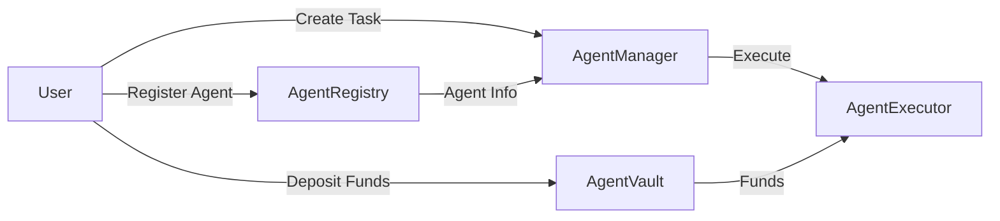

# Smart Contracts Overview

The Somnia Agent Kit consists of four core smart contracts that work together to enable AI agent operations on the blockchain.

## Core Contracts

### AgentRegistry.sol
Manages agent registration, discovery, and metadata.

**Key Functions:**
- `registerAgent(name, description, ipfsMetadata, capabilities)`: Register new agent
- `updateAgent(agentId, name, description, ipfsMetadata, capabilities)`: Update agent info
- `setAgentStatus(agentId, isActive)`: Activate/deactivate agent
- `getAgent(agentId)`: Get agent details
- `getTotalAgents()`: Get total agent count
- `getAgentsByOwner(owner)`: Get agents by owner
- `transferAgentOwnership(agentId, newOwner)`: Transfer ownership

**Contract Address (Testnet):** `0xC9f3452090EEB519467DEa4a390976D38C008347`

[📖 Full Documentation](./contracts/agent-registry.md)

### AgentManager.sol
Handles task creation, assignment, and lifecycle management.

**Key Functions:**
- `createTask(agentId, taskData, { value })`: Create new task
- `startTask(taskId)`: Start task execution
- `completeTask(taskId, result)`: Complete task with result
- `cancelTask(taskId)`: Cancel task
- `getTask(taskId)`: Get task details

**Task Status:**
- `0` - Pending
- `1` - InProgress
- `2` - Completed
- `3` - Cancelled

**Contract Address (Testnet):** `0x77F6dC5924652e32DBa0B4329De0a44a2C95691E`

[📖 Full Documentation](./contracts/agent-manager.md)

### AgentVault.sol
Manages agent funds with daily limits and multi-token support.

**Key Functions:**
- `createVault(agent, dailyLimit)`: Create vault for agent (owner only)
- `depositNative(agent)`: Deposit native tokens
- `depositToken(agent, token, amount)`: Deposit ERC20 tokens
- `withdrawNative(agent, recipient, amount)`: Withdraw native tokens
- `withdrawToken(agent, token, recipient, amount)`: Withdraw ERC20 tokens
- `allowToken(agent, token)`: Enable ERC20 token (owner only)
- `updateDailyLimit(agent, newLimit)`: Update daily limit (owner only)
- `getNativeBalance(agent)`: Get native token balance
- `getTokenBalance(agent, token)`: Get ERC20 token balance
- `getDailyLimitInfo(agent)`: Get daily limit info
- `isVaultActive(agent)`: Check if vault is active

**Important:** Vault uses agent addresses (not IDs) for all operations.

**Contract Address (Testnet):** `0x7cEe3142A9c6d15529C322035041af697B2B5129`

[📖 Full Documentation](./contracts/agent-vault.md)

### AgentExecutor.sol
Handles task execution with authorization and gas management.

**Key Functions:**
- `authorizeAgent()`: Authorize agent for execution
- `executeTask()`: Execute agent task
- `getExecution()`: Get execution details

**Contract Address (Testnet):** `0x157C56dEdbAB6caD541109daabA4663Fc016026e`

[📖 Full Documentation](./contracts/agent-executor.md)

## Contract Interactions



## Quick Start

### Initialize SDK

```typescript
import { SomniaAgentKit, SOMNIA_NETWORKS } from 'somnia-agent-kit';

const kit = new SomniaAgentKit({
  network: SOMNIA_NETWORKS.testnet,
  contracts: {
    agentRegistry: '0xC9f3452090EEB519467DEa4a390976D38C008347',
    agentManager: '0x77F6dC5924652e32DBa0B4329De0a44a2C95691E',
    agentExecutor: '0x157C56dEdbAB6caD541109daabA4663Fc016026e',
    agentVault: '0x7cEe3142A9c6d15529C322035041af697B2B5129',
  },
  privateKey: process.env.PRIVATE_KEY,
});

await kit.initialize();
```

### Register an Agent

```typescript
const tx = await kit.contracts.registry.registerAgent(
  'My Agent',
  'Agent description',
  'QmIPFSHash',
  ['capability1', 'capability2']
);
await tx.wait();
```

### Create a Task

```typescript
const tx = await kit.contracts.manager.createTask(
  agentId,
  JSON.stringify({ action: 'analyze' }),
  { value: ethers.parseEther('0.001') }
);
await tx.wait();
```

### Create a Vault

```typescript
// Get agent address from registry
const agent = await kit.contracts.registry.getAgent(agentId);
const agentAddress = agent.owner;

// Create vault
const dailyLimit = ethers.parseEther('1.0');
const tx = await kit.contracts.vault.createVault(agentAddress, dailyLimit);
await tx.wait();
```

## Development

### Deploy Contracts

```bash
cd contracts
npx hardhat run scripts/deploy.ts --network testnet
```

### Verify Contracts

```bash
npx hardhat run scripts/verify.ts --network testnet
```

### Run Tests

```bash
npx hardhat test
```

## Network Information

### Somnia Testnet
- **Chain ID:** 50311
- **RPC URL:** https://dream-rpc.somnia.network
- **Explorer:** https://somnia-devnet.socialscan.io
- **Currency:** STT (Somnia Test Token)

### Somnia Mainnet
Coming soon

## Related Documentation

- [AgentRegistry Contract](./contracts/agent-registry.md)
- [AgentManager Contract](./contracts/agent-manager.md)
- [AgentVault Contract](./contracts/agent-vault.md)
- [AgentExecutor Contract](./contracts/agent-executor.md)
- [SDK Usage Guide](./sdk-usage.md)
- [Examples](../examples/README.md)

## Security Considerations

1. **Private Keys** - Never commit private keys to version control
2. **Daily Limits** - Set appropriate daily limits for vaults
3. **Token Whitelist** - Only allow trusted tokens in vaults
4. **Owner Verification** - Always verify ownership before sensitive operations
5. **Gas Management** - Ensure sufficient gas for operations

---

For more detailed information about each contract, see their individual documentation pages.
